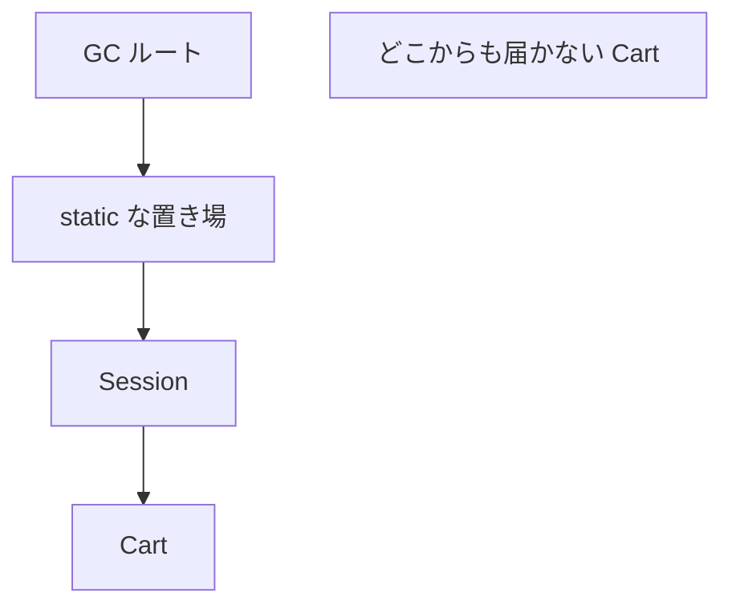
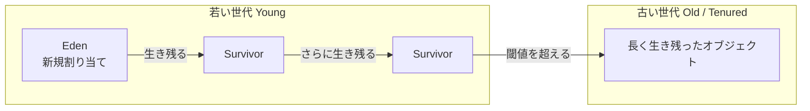

# ヒープとガベージコレクション

[型とメモリ](./types-and-memory) で、オブジェクトの実体はヒープに乗り、参照が残るかぎり使えることを見ました。  
言語の骨格（コレクションや Stream の入口）を一通り踏んだうえで、このページでは **いつ不要と判定され、どう回収されるか** の本線を押さえます。

本線は三つです。

1. 到達可能性（ルートから届くか）
2. 世代別という仮説（若い領域を頻繁に掃く）
3. Stop-The-World（一時停止）

「GC があるからメモリは気にしなくてよい」は、Java でいちばん高い誤解のひとつです。  
回収されるのは到達できなくなったオブジェクトだけで、到達できるままの「もう使わないデータ」は残り続けます。

## このページで分かること

- 到達可能性と GC ルート
- 若い領域と古い領域に分ける理由（世代別 GC の仮説）
- マイナー GC / フル GC、Stop-The-World の意味

対象のイメージは **Java 17 以降のホットスポット JVM** です。  
コレクタ名やログ・ヒープサイズは次の [GC の地図とチューニング入口](./gc-collectors-and-tuning) で扱います。

## なぜ GC をきちんと見るか

注文処理が昼間だけ重い、夜のバッチでヒープが右肩上がり、デプロイのたびにメモリが戻らない——こうした症状を「たぶんリーク」で片付けると、次の一手が勘になります。

実際には、次のどれか（または複合）です。

- 一時オブジェクトを作りすぎて、若い領域の GC が忙しい
- キャッシュやセッションが参照を持ち続け、古い領域が埋まっていく
- ヒープではなくメタスペースやネイティブ側が足りない
- そもそも遅さの本体は DB や外部 API で、GC は巻き添え

コードを読む前に、**何が回収対象で、何がルートから見えているか** の語彙がないと、ダンプも GC ログも読めません。

:::tip[GC が約束すること]

GC は、到達不能になった Java オブジェクトのヒープメモリを回収します。  
ファイル、ソケット、DB 接続のような外部リソースのクローズまでは請け負いません。  
「不要だと人間が思っている」ことと、「ルートから到達できない」ことは別です。

:::

## 到達可能性が回収の判定基準

変数を `null` にしたから消える、ではありません。  
**GC ルートから参照をたどって届くか** が基準です。

暗い倉庫で、入口の灯りからケーブルをたどって届く棚だけが見える——届かない棚は、次の掃除で片付けてよい、というイメージです。

```java
Cart cart = new Cart();
cart = null;
```

この `Cart` を指す経路が他になければ、回収候補になります。  
同じオブジェクトを `static` なマップや、別スレッドのキュー、未完了のリスナーが指していれば、ローカル変数を消しても残り続けます。



上図の `Cart` はルートから届くので生きています。  
`orphan` は届かないので、次の GC で回収され得ます。

ここでの一行です。

> 回収の判定は「もう使わないつもり」ではなく、「ルートから到達できるか」である。

### GC ルートの代表例

「誰が起点になってヒープを照らしているか」がルートです。  
学習上よく出るものは次です。

| ルートの種類                     | イメージ                                                     |
| -------------------------------- | ------------------------------------------------------------ |
| スタック上のローカル変数・引数   | いま動いているメソッドが握っている参照                       |
| `static` フィールド              | クラスに紐づく共有。クラスがアンロードされない限り残りやすい |
| JNI などネイティブが保持する参照 | Java 側から見えにくい保持                                    |
| 実行中スレッドそのもの           | スレッドが生きているあいだ、そのスタックはルートになる       |

調査で重要なのは、残っているインスタンスのクラス名より、**どのルート経由で照らされているか** です。  
その読み方は、並行処理のあとの [メモリリークとヒープダンプ](./memory-leaks-and-dumps) で扱います。

### 「生きている」の単位はオブジェクトグラフ

カートがラインアイテムのリストを持っているなら、カートが生きているかぎりラインアイテムも生きます。  
逆に、カートへの参照がすべて切れれば、そこからしか届かなかった子もまとめて不要になります。

```java
Order order = loadOrder();
process(order);
order = null; // このメソッド内の箱は切れた
```

`process` がフィールドやキャッシュに `order` を保存していれば、まだ届きます。  
ローカル変数の寿命と、オブジェクトグラフの寿命を分けて考えてください。

<QuizChoice
title="到達できないとは"
options={[
{id: 'a', label: 'A の pdf の方が回収候補になりやすい'},
{id: 'b', label: 'B の pdf の方が回収候補になりやすい'},
{id: 'c', label: 'どちらも同じタイミングで必ず回収される'},
]}
answer="b"
explanation="GC が見るのは到達可能かどうかです。A は static な置き場が照らし続けるので残りやすいです。B はメソッドを抜けて他から届かなければ回収候補になります。"

>

  <div>回収候補になりやすいのはどちらですか。</div>
  <pre className="language-java"><code>{`// A（static な置き場が照らし続ける）
static final Object[] hold = new Object[1];
void cache(byte[] pdf) {
    hold[0] = pdf;
}

// B（メソッドを抜けたら、他から届かなければ切れやすい）
void once() {
byte[] pdf = loadPdf();
send(pdf);
}`}</code></pre>
</QuizChoice>

## 世代別という仮説

多くのホットスポットの GC は、オブジェクトを年齢で分けて扱います。  
根拠は経験則です。

> ほとんどのオブジェクトはすぐに不要になる。  
> しばらく生き残ったものは、さらに長く生きやすい。

短い寿命のものを頻繁に、狭い領域で掃く方が、ヒープ全体を毎回なめるより安く済みます。  
これが **世代別 GC（generational GC）** の発想です。

学習用の地図は次です。



名前や領域の切り方はコレクタによって違います（G1 は領域を Region に分割します）。  
最初に持つイメージは次で足ります。

- **Eden** … 新しいオブジェクトがまず置かれる場所
- **Survivor** … Eden の回収を生き延びたものが一時的に退避する場所
- **Old** … 何度も生き延びたものが昇格（promotion）する場所

若い世代の回収を **マイナー GC**、古い世代を含む大きめの回収を **メジャー GC / フル GC** と呼ぶことがあります。  
用語はコレクタと資料で揺れるので、ログを読むときは「若い領域だけか、ヒープ全体に近いか」「アプリケーションスレッドを止めたか」を先に見ます。

### なぜ「すぐ死ぬ」が多いのか

リクエスト 1 件の処理では、DTO、一時リスト、文字列連結の中間結果、例外オブジェクトなど、メソッドを抜けたら不要になるものが大量に出ます。  
これらが Eden で生まれ、マイナー GC で消えるのが健全なパターンです。

問題になるのは、次のようなずれです。

- 一時のつもりがキャッシュに入り、Old へ昇格して残る
- 巨大な配列やバイト列を毎回割り当て、若い領域がすぐ埋まる
- 昇格が多すぎて Old が埋まり、重い GC が増える

「割り当てが速い」こと自体は正常です。  
Java のアロケーションは、スレッド専用の小さな塊（**TLAB: Thread-Local Allocation Buffer**）へ順番に領域を切り出す実装が多く、短い寿命のオブジェクトを量産する前提に近いです。

<details>
<summary>オブジェクトが必ずヒープに行くとは限らない</summary>

JIT は、メソッド内で完結し外へ漏れないオブジェクトを、ヒープに置かずレジスタやスタック側で済ませる最適化（エスケープ解析）を行うことがあります。  
学習の第一歩では「`new` はヒープ」で考えて問題ありません。  
プロファイラで割り当てが見えない一時オブジェクトがある、という話が出たら、この最適化を疑う、程度で十分です。

</details>

<QuizChoice
title="世代別 GC の発想"
options={[
{id: 'a', label: 'すべてのオブジェクトを毎回ヒープ全体から探すのが基本方針'},
{id: 'b', label: 'すぐ不要になるものが多いので、若い領域を頻繁に掃く'},
{id: 'c', label: 'Old に昇格したオブジェクトは、二度と回収されない'},
]}
answer="b"
explanation="ほとんどのオブジェクトはすぐに不要になる、という仮説のもと、若い世代を頻繁に掃きます。Old も回収対象になり得ます。"

>

  <div>次の説明のうち、世代別 GC の芯に近いものはどれですか。</div>
  <pre className="language-text"><code>{`Eden → Survivor →（生き延びる）→ Old`}</code></pre>
</QuizChoice>

## Stop-The-World と「止まったように見える」

多くの GC 作業では、アプリケーションスレッドを一時停止する区間があります。  
これを **Stop-The-World（STW）** と呼びます。

ユーザーから見ると、ある瞬間だけ応答が止まる、テールレイテンシが跳ねる、という形で出ます。  
「CPU は空いているのに遅い」ときに、GC 一時停止を疑う根拠のひとつです。

コレクタの進化は、この停止を短くする方向に寄っています。  
一方で、停止が短い代わりに CPU を常時使う、ヒープを大きめに要求する、といったトレードオフもあります。

:::warning[停止時間だけを最適化しない]

スループット（単位時間あたりの仕事量）と、一時停止の短さは両立しないことが多いです。  
バッチなら多少止まっても全体が速ければよく、対話的な API なら短い停止の方が価値があります。  
目的を決めずにコレクタやフラグをいじると、別の指標が悪化します。

:::

## よくあるつまずき

- `null` 代入やローカル変数の終了だけで、共有キャッシュ上のオブジェクトが消えると思う
- GC があるのでファイルやコネクションも自動で閉じると考える
- ヒープ使用量が増えた瞬間を、すべてメモリリークと呼ぶ（スパイクと右肩上がりは別）

## まとめ / 次に学ぶとよいこと

- 回収対象は「到達不能」であり、「もう使わないつもり」ではない
- 若いオブジェクトを頻繁に掃き、生き残ったものを古い領域へ上げる、という仮説が世代別 GC の芯
- STW は応答のテールに出る。スループットとのトレードオフを先に決める

コレクタの地図、弱い参照、ヒープ以外のメモリ、サイズ指定とログは次の [GC の地図とチューニング入口](./gc-collectors-and-tuning) へ進みます。  
型パラメータの続きは [ジェネリクスと現代的な型](./generics-and-modern-types) です。  
「誰が照らしているか」をダンプで追う手順は、並行処理のあとの [メモリリークとヒープダンプ](./memory-leaks-and-dumps) へ進みます。
