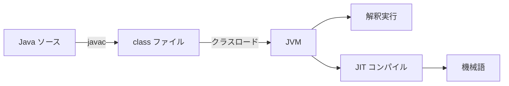
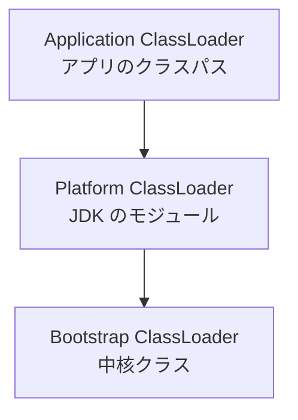

# JVM とクラスローディング

バイトコードがあっても、JVM がクラスとして読み込むまでは使えません。  
普段の業務では毎日意識しませんが、アプリケーションサーバ、テストランナー、ホットリロード、ライブラリ競合では、クラスローダーの地図が調査の出発点になります。

ヒープと GC の本体は [ヒープとガベージコレクション](./heap-and-gc) と [メモリリークとヒープダンプ](./memory-leaks-and-dumps) にあります。  
このページは、実行環境側の読み込みと、性能を見るときの前提に絞ります。

## このページで分かること

- ロード、リンク、初期化の段階
- 親委譲と、クラスの同一性（名前だけでは足りない）
- 実行環境がクラスを探す場面と、コンテキストクラスローダー
- JIT や起動直後の性能差を、GC と切り分ける見方

## JVM がコードを実行する

コンパイラはソースをバイトコードへ落とし、JVM が読み込んで実行します。  
頻繁に通る箇所は、実行中に機械語へ落とす **JIT コンパイル** の対象になります。



起動直後と、十分に暖まったあとで遅さが違うのは、クラスロードと JIT の準備が進むためです。  
短いベンチマークだけで本番性能を語れない理由のひとつです。

## クラスは必要になったときに読まれる

`.class` があることと、JVM 上の `Class` として使えることは別です。

```text
.class ファイル
  ↓ ClassLoader が読み込む
JVM 上の Class オブジェクト
```

```java
Shipment shipment = new Shipment();
```

`Shipment` が初めて必要になったタイミングで、ローダーがファイルを探し、読み、検証します。  
起動時にアプリケーションの全クラスが載るわけではありません。  
だから、「起動はできたのに、ある操作の直前でクラスが見つからない」が起きます。

扱いは大きく三段階です。

```text
loading -> linking -> initialization
```

| 段階 | 概要 |
| ---- | ---- |
| loading | バイトコードを探して読み込む |
| linking | 検証、準備、他クラスへの参照の解決 |
| initialization | `static` 初期化子や `static` フィールドの初期化 |

```java
class PricingRules {
    static {
        System.out.println("PricingRules initialized");
    }
}
```

このブロックは、`PricingRules` が初期化されるときに走ります。  
ソースに書いてあるから起動直後に必ず走る、ではありません。

`static` フィールドの値が「クラスに属する共有」であることは、[型とメモリ](./types-and-memory) で見たとおりです。  
初期化のタイミングは、このロード過程にぶら下がっています。

## 親委譲モデル

クラスローダーは階層を持ちます。  
多くの場合、自分で探す前に親へ委譲します。  
親が見つけられなかったとき、自分の担当範囲から探します。



ここでの親は、Java の継承ではありません。  
探す順番の話です。

アプリケーション側に `java.lang.String` と同名のクラスを置いても、通常は標準の `String` が先に採用されます。  
基盤クラスが、アプリ同名クラスで簡単に差し替わらないための仕組みです。

「JAR を置いたのに読まれない」「サーバ同梱のライブラリが先に見える」は、この順番で説明できることが多いです。

<details>
<summary>親委譲以外の探索順</summary>

アプリケーションサーバやプラグイン基盤には、子を優先する探索を採るものがあります。  
「親が常に勝つ」と決めつけず、実行環境のクラスローダー仕様を確認します。

</details>

## クラスの同一性は名前だけでは決まらない

JVM 上の同一クラスは、だいたい次の組です。

```text
同じクラス = 完全修飾クラス名 + クラスローダー
```

同じ `com.example.Shipment` でも、ローダーが違えば別型です。

```text
ClassLoader A の com.example.Shipment
  は
ClassLoader B の com.example.Shipment
  へキャストできない
```

見た目は次の例外になります。

```text
java.lang.ClassCastException: com.example.Shipment cannot be cast to com.example.Shipment
```

テストランナー、ホットリロード、プラグイン、アプリケーションサーバで、この形を見たら名前のタイポより先にローダーを疑います。

## 実行環境がクラスを探す

Servlet コンテナやアプリケーションサーバでは、サーバ実装側とアプリケーション側でローダーが分かれることがあります。

```text
サーバ側
  Servlet API やサーバ実装、共通ライブラリ

アプリ側
  アプリケーションのクラス
  WAR / JAR に含めたライブラリ
```

コンパイル時に必要な API を実行環境が提供する場合、ビルドでは `provided` スコープにすることがあります。  
アプリ側に同じ API の別コピーを梱包すると、実行時だけ衝突します。

```xml
<dependency>
  <groupId>jakarta.servlet</groupId>
  <artifactId>jakarta.servlet-api</artifactId>
  <version>6.0.0</version>
  <scope>provided</scope>
</dependency>
```

Jakarta EE でも Spring でも、「誰が実行時にクラスを提供するか」は同じ問いです。  
どちらが正しい梱包か、は製品の流儀に従います。

設定ファイルにクラス名が書いてあり、コンテナが文字列からロードする、という経路もあります。  
アプリケーションコードが `new` していなくても、実行環境がアプリ側のローダーでクラスを探します。

ビルドの依存ツリーと、実行時に勝つ JAR は一致しません。  
`ClassNotFoundException` と `NoClassDefFoundError` の切り分け、サーバ同梱との二重持ちは、Maven のスコープの話ともつながります。

## コンテキストクラスローダー

ライブラリ側のコードが、呼び出し元アプリケーションのクラスや設定ファイルを探したいことがあります。  
そのとき、ライブラリ自身のローダーではなく、スレッドに載っている **コンテキストクラスローダー** を使うことがあります。

```java
try (InputStream input = Thread.currentThread()
        .getContextClassLoader()
        .getResourceAsStream("config/app.properties")) {
    // ...
}
```

```text
フレームワークのクラス
  framework.jar からロードされている

探したいもの
  アプリ側の設定
  アプリ側の SPI 実装
```

`ServiceLoader` も、どのローダーから実装を集めるかが結果を変えます。  
JDBC ドライバのように `META-INF/services/` で実装クラス名を宣言する仕組みでは、ドライバ JAR がサーバ共通にあるのか、アプリケーションに同梱されているのかで見え方が変わります。

<details>
<summary>SPI の最小イメージ</summary>

利用側はインタフェースだけを知り、実装クラス名は JAR 内の宣言ファイルに書きます。

```text
META-INF/services/java.sql.Driver
```

中身は実装の完全修飾名です。  
`DriverManager.getConnection(...)` が具体クラスを `new` しないのは、この発見経路があるからです。  
業務ロジックで毎日書くものではありませんが、「後から実装を足す」仕組みはローダーとセットです。

</details>

フレームワークや実行基盤を書く側は、`Class.forName` が **どのローダー基準か** を意識します。  
業務アプリを書く側は、まず「実行環境が提供するものを二重に梱包していないか」を疑います。

## 再デプロイとメタスペース

古いクラスローダーが、スレッドや `ThreadLocal`、JMX、ドライバ登録、キャッシュのグローバル領域から参照されていると、そのローダーがロードしたクラスはアンロードされません。  
ヒープ上のアプリケーションオブジェクトだけでなく、[ヒープとガベージコレクション](./heap-and-gc) で見た **メタスペース** が増え続けます。

「オブジェクトのリーク」と「ローダーのリーク」は、ダンプの見え方も直し方も違います。  
再デプロイのたびに一段上がるメモリは、後者を疑う合図です。

## 性能は計測してから考える

遅さの原因は、CPU、ヒープ、ロック、ファイル I/O、データベース、ネットワーク、外部サービスと多様です。  
GC が多いときの二分法（作りすぎ／持ちすぎ）は、メモリ側のページで扱いました。  
こちらでは、次を混同しないことが先です。

- 起動直後だけ遅い（クラスロードと JIT）
- 暖まったあとも CPU を食い続ける（計算、ロック、GC）
- CPU は空なのに遅い（待ち。DB や外部 API が多い）

流れは次です。

1. 遅い操作、時刻、頻度、入力条件を特定する
2. CPU、メモリ、待ち時間、エラー率、GC 停止を集める
3. 仮説を一つに絞る
4. 小さな変更で検証する
5. 同じ条件で再計測し、副作用も見る

ヒープサイズや GC 方式の変更は、対象 JDK の公式資料と観測結果に基づきます。  
根拠なくフラグを増やすと、停止時間とスループットの別の問題を呼びます。

:::tip[計測が先、調整はあと]

変更前の基準値とボトルネックを確認し、1 つずつ変えて同じ条件で測ります。

:::


<QuizChoice
  title="クラスの同一性"
  options={[
    {id: 'a', label: '完全修飾名が同じなら、どのクラスローダーでも同じ型'},
    {id: 'b', label: '完全修飾名に加え、読み込んだクラスローダーも同一性に関わる'},
    {id: 'c', label: 'クラスローダーは起動時に一度だけ使われ、あとは関係ない'},
  ]}
  answer="b"
  explanation="同じ名前でもローダーが違えば別型として扱われ、見た目が同じ ClassCastException の原因になります。"
>
  <div>JVM 上で「同じクラス」かどうかを考えるとき、正しいものはどれですか。</div>
</QuizChoice>

## よくあるつまずき

- 同じ完全修飾名なら、別ローダーでも同じ型だと考える
- Maven 上は一つのバージョンなのに、実行時はサーバ同梱が勝っている
- 外部リソースの解放を GC に任せる
- 起動直後の測定だけで JIT 後の性能を語る
- メモリ使用量の増加を、すべてオブジェクトリークと断定する（メタスペースやネイティブを見ない）

## まとめ

- クラスは必要になったときにロードされ、`static` 初期化はその過程で走る
- 同一性はクラス名とクラスローダーの組で決まる
- 実行環境とアプリでローダーが分かれると、梱包の二重持ちが実行時だけ壊れる
- JIT とクラスロードは、短い測定を裏切る
- ヒープの寿命設計はメモリの章、読み込みの地図はこのページ、と役割を分ける

ここまでで、言語の土台から JVM 上の実行までが一通りつながります。  
次は [Maven](../maven/) で、依存関係とビルドの再現性へ進みましょう。  
節の入口は [Java 言語](./) です。
