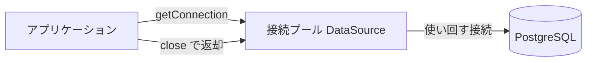

# JDBC の基礎

SQL が正しくても、接続を閉じ忘れたり、途中で失敗した更新だけが残ったりすると、アプリケーション全体の問題になります。  
JDBC では、SQL の実行だけでなく接続、パラメーター、トランザクションの境界を一緒に扱います。

:::info[このページの前提]

表・行・主キーは [表とキー](../../../data/sql-rdb/tables-and-keys)、`SELECT` は [SELECT の基本](../../../data/sql-rdb/select-basics)、複数更新のまとめ方は [トランザクション](../../../data/sql-rdb/transactions) です。  
ここからは、同じ PostgreSQL の `orders` 表を **Java から** どう開いて読むかに進みます。

:::

## このページで分かること

- JDBC Driver、`Connection`、`PreparedStatement` の役割
- `DriverManager` と `DataSource`（接続プール）の違い
- パラメーター化した SQL が必要な理由
- `commit` と `rollback` によるトランザクションの基本

## JDBC の登場人物

JDBC は、Java からリレーショナルデータベースを操作する標準 API です。  
会話の窓口が分かれている、と覚えると役割が追いやすいです。

- JDBC Driver: JDBC の呼び出しを各データベース固有の通信へ変換する
- `Connection`: データベースとの接続とトランザクション境界を表す
- `PreparedStatement`: パラメーター化した SQL を実行する
- `ResultSet`: 検索結果を順に読み取る
- `DataSource`: 接続の取り出し口。現場では接続プールのことが多い

Driver は、利用するデータベースに対応した依存関係として追加します。  
PostgreSQL なら、次のような依存が典型です（バージョンはプロジェクトに合わせて確認してください）。

```xml
<dependency>
  <groupId>org.postgresql</groupId>
  <artifactId>postgresql</artifactId>
  <version>42.7.4</version>
</dependency>
```

接続 URL の部品（ホスト、ポート、データベース名）は、[接続と psql](../../../data/sql-rdb/connect-and-psql) と同じです。  
JDBC では先頭が `jdbc:` になります。

```text
jdbc:postgresql://localhost:5432/appdb
```

## 接続を開く

学習や短い検証では、`DriverManager` で都度接続できます。  
パスワードはコードやリポジトリに直書きせず、環境変数などから渡します。

```java
String url = "jdbc:postgresql://localhost:5432/appdb";
String user = "appuser";
String password = System.getenv("APPDB_PASSWORD");

try (Connection connection = DriverManager.getConnection(url, user, password)) {
    // ここで SQL を実行する
}
```

`getConnection` が成功すれば、`psql` でつながったのと同じく、その接続上で SQL を打てる状態です。  
`try-with-resources` で閉じると、例外パスでも接続が残りにくくなります。

:::warning[都度接続は検証向き]

`DriverManager.getConnection` は、呼ぶたびに新しい接続を張りがちです。  
リクエストのたびにこれを繰り返すと、接続の確立だけで遅くなり、データベース側の接続数もすぐ逼迫します。

:::

## DataSource と接続プール

実務のアプリケーションでは、`DataSource` から接続を取ります。  
`DataSource` 自体は「接続を貸す窓口」のインタフェースです。  
実装の多くは **接続プール** で、あらかじめ張っておいた接続を使い回します。

```java
HikariDataSource dataSource = new HikariDataSource();
dataSource.setJdbcUrl("jdbc:postgresql://localhost:5432/appdb");
dataSource.setUsername("appuser");
dataSource.setPassword(System.getenv("APPDB_PASSWORD"));
dataSource.setMaximumPoolSize(10);
```

HikariCP はよく使われる実装の一例です。  
使うときは専用の依存関係が必要で、フレームワークを使う現場では設定から同等の `DataSource` が用意されることも多いです。



プールから借りた `Connection` を `close` すると、多くの実装では TCP を切らず **プールへ返します**。  
返さないと、上限に達したあと `getConnection` が待ち続けたり失敗したりします。  
これが「接続枯渇」です。

DAO や ORM の選択、トランザクションをどの層に置くかは [データアクセス](../applications/data-access) に任せます。  
このページでは、「接続は借りて、使い終わったら返す」ことと、SQL の実行手順に集中します。

<QuizChoice
title="接続の取り方"
options={[
{id: 'a', label: 'リクエストごとに DriverManager.getConnection するのが、本番でも常に最善である'},
{id: 'b', label: 'DataSource（多くの場合は接続プール）から借り、使い終わったら閉じる（返却する）'},
{id: 'c', label: 'Connection はアプリ起動中ずっと 1 本だけ持ち、close してはいけない'},
]}
answer="b"
explanation="検証では DriverManager でも足ります。本番ではプール付き DataSource から借り、close で返却するのが基本です。1 本を使い回すとトランザクションとスレッド安全が壊れます。"

>

  <div>Web アプリから PostgreSQL へつなぐとき、適切な方針はどれですか。</div>
</QuizChoice>

## PreparedStatement で検索する

[SELECT の基本](../../../data/sql-rdb/select-basics) と同じく、列を明示し、主キーで 1 行に絞ります。

```java
String sql = """
    SELECT order_id, user_id, amount
      FROM orders
     WHERE order_id = ?
    """;

try (Connection connection = dataSource.getConnection();
     PreparedStatement statement = connection.prepareStatement(sql)) {

    statement.setLong(1, orderId);

    try (ResultSet result = statement.executeQuery()) {
        if (result.next()) {
            long id = result.getLong("order_id");
            long userId = result.getLong("user_id");
            int amount = result.getInt("amount");
        }
    }
}
```

SQL の 1 行が `ResultSet` の 1 行、列名が `getLong("order_id")` などの取り出し口です。  
`result.next()` が `false` なら、条件に合う行が無かっただけで、SQL が壊れているとは限りません。

`?` の位置に `setLong` などで値を設定します。  
列名を明示すると、SQL と Java 側の対応を追いやすくなります。

:::warning[SQL を文字列連結で組み立てない]

外部入力を SQL 文字列へ連結すると、SQL インジェクションにつながります。  
値は `PreparedStatement` のプレースホルダーへ設定します。

:::

値ではなく、テーブル名や並び順などの SQL 構造はプレースホルダーにできません。  
動的に切り替える必要がある場合は、許可した候補から選ぶ設計にします。

接続・Statement・ResultSet は OS 側の資源です。  
上の例のように `try-with-resources` で閉じると、例外パスでも漏れにくくなります。

<QuizChoice
title="PreparedStatement"
options={[
{id: 'a', label: '外部入力を SQL 文字列へ連結して組み立てる'},
{id: 'b', label: '値は ? プレースホルダーへ set する'},
{id: 'c', label: 'テーブル名も ? で必ず渡す'},
]}
answer="b"
explanation="値は PreparedStatement のプレースホルダーへ設定します。文字列連結は SQL インジェクションの温床です。テーブル名などの構造はプレースホルダーにできません。"

>

  <div>次の検索で、正しい方針はどれですか。</div>
  <pre className="language-java"><code>{`String sql = """
    SELECT order_id, amount
      FROM orders
     WHERE order_id = ?
    """;
statement.setLong(1, orderId);`}</code></pre>
</QuizChoice>

<QuizChoice
title="JDBC とリソース"
options={[
{id: 'a', label: 'ResultSet や Statement は GC に任せればよい'},
{id: 'b', label: 'Connection / Statement / ResultSet も閉じる（try-with-resources など）'},
{id: 'c', label: 'コミットさえすれば close は不要'},
]}
answer="b"
explanation="JDBC の資源も外部リソースです。例外パスも含め、try-with-resources などで確実に閉じます。トランザクションの commit/rollback とは別の話です。"

>

  <div>次のように書く意図として、正しいものはどれですか。</div>
  <pre className="language-java"><code>{`try (Connection connection = dataSource.getConnection();
     PreparedStatement statement = connection.prepareStatement(sql);
     ResultSet result = statement.executeQuery()) {
    // 結果を読む
}`}</code></pre>
</QuizChoice>

## 更新件数を確認する

[追加・更新・削除](../../../data/sql-rdb/insert-update-delete) の `UPDATE 1` と同じ情報を、Java では戻り値で受け取ります。

```java
String sql = "UPDATE orders SET amount = ? WHERE order_id = ?";

try (Connection connection = dataSource.getConnection();
     PreparedStatement statement = connection.prepareStatement(sql)) {

    statement.setInt(1, newAmount);
    statement.setLong(2, orderId);

    int updated = statement.executeUpdate();
    if (updated != 1) {
        throw new IllegalStateException("unexpected update count: " + updated);
    }
}
```

`executeUpdate` は更新した行数を返します。  
1 件のはずが 0 件や複数件なら、条件やデータの前提が崩れていないか確認できます。

## commit と rollback

複数の更新をまとめて成功または失敗させるには、トランザクションを使います。  
SQL 側の `BEGIN` / `COMMIT` / `ROLLBACK` に対応するのが、接続上の `setAutoCommit(false)`、`commit`、`rollback` です。

```java
try (Connection connection = dataSource.getConnection()) {
    connection.setAutoCommit(false);

    try {
        updateOrder(connection, orderId);
        insertHistory(connection, orderId);
        connection.commit();
    } catch (SQLException e) {
        connection.rollback();
        throw e;
    }
}
```

注文の状態更新と履歴追加を同じ接続・同じトランザクションに載せると、片方だけ残る状態を避けられます。  
`setAutoCommit(false)` で自動コミットを止め、すべて成功したら `commit` します。  
途中で失敗したら `rollback` し、中途半端な更新を残さないようにします。

実際のアプリケーションでは、フレームワークやトランザクション管理機能が境界を管理する場合があります。  
その場合でも、どの処理が同じトランザクションに含まれるかを理解する必要があります。

<details>
<summary>例外と rollback の扱い</summary>

`rollback` 自体も失敗する可能性があります。  
本来の例外を失わないよう、利用するライブラリやプロジェクトの例外処理方針に従います。  
接続プールへ返す前に接続状態を復元する処理は、通常は DataSource や管理基盤へ任せます。

</details>

<QuizChoice
title="commit と rollback"
options={[
{id: 'a', label: '途中で失敗しても commit すれば整合する'},
{id: 'b', label: '成功したら commit、失敗したら rollback で中途半端な更新を残さない'},
{id: 'c', label: 'autoCommit を true のまま複数更新すれば十分'},
]}
answer="b"
explanation="複数更新をまとめるときは autoCommit を止め、成功時 commit・失敗時 rollback が基本です。"

>

  <div>次のパターンについて、正しいものはどれですか。</div>
  <pre className="language-java"><code>{`connection.setAutoCommit(false);
try {
    updateOrder(connection, orderId);
    insertHistory(connection, orderId);
    connection.commit();
} catch (SQLException e) {
    connection.rollback();
    throw e;
}`}</code></pre>
</QuizChoice>

## ORM や SQL マッパーとの関係

JPA のような ORM は、Java オブジェクトとテーブルの対応付けを抽象化します。  
MyBatis のような SQL マッパーは、SQL を明示しながら結果との対応付けを支援します。  
どちらも選択肢であり、データモデル、SQL の制御範囲、チームの運用などで適性が変わります。

これらの仕組みも下層では JDBC やデータベース接続を利用します。  
JDBC の基礎を知っていると、発行 SQL、接続枯渇、トランザクション境界の調査に役立ちます。  
方式の比較は [データアクセス](../applications/data-access) にまとめています。

## よくあるつまずき

- 外部入力を SQL 文字列へ連結する
- `Connection`、`PreparedStatement`、`ResultSet` を閉じない（プールでは返却漏れになる）
- リクエストごとに `DriverManager` で新規接続し、接続数が膨らむ
- 更新件数を確認せず、対象がなかったことを見逃す
- トランザクションの範囲を広げすぎ、接続やロックを長く保持する
- ORM を使えば SQL やトランザクションを理解しなくてよいと考える

## まとめ

- JDBC では接続、SQL、結果、トランザクションを明示的に扱う
- 検証は `DriverManager`、アプリは `DataSource`（接続プール）から借りて返す
- 値は `PreparedStatement` に設定し、SQL インジェクションを防ぐ
- 複数更新は `commit` と `rollback` で一貫性を守る
- JPA や MyBatis などの上位層を使う場合も、JDBC の理解は調査に役立つ

次は [並行処理](./concurrency) で、複数のタスクを安全に実行する考え方を学びます。
