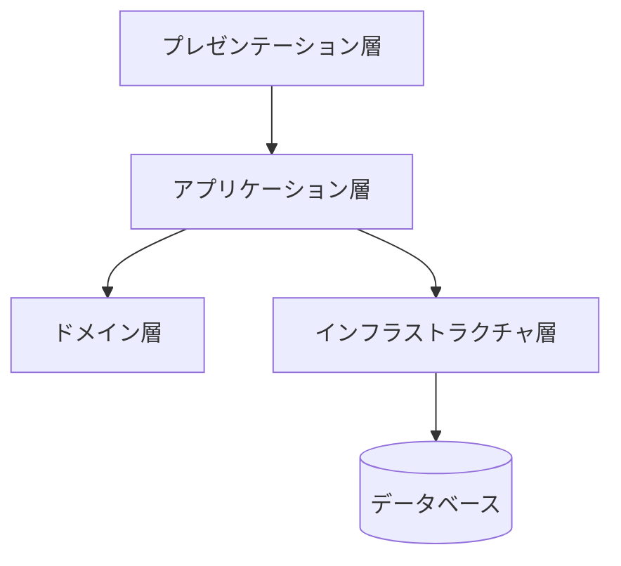

# レイヤードアーキテクチャと MVC

HTTP の入力処理、注文の規則、SQL がひとつのメソッドに並ぶと、画面変更でもデータベース変更でも同じ場所を触ることになります。  
レイヤードアーキテクチャと MVC は、役割の違うコードを分け、変更の影響を局所化するための代表的な整理方法です。

建物の間取り図を思い浮かべてください。  
玄関（入出力）、執務室（ユースケース）、金庫（業務規則）、倉庫（技術詳細）が混ざっていると、来客対応のたびに金庫の鍵まで触ることになります。  
層は、どの部屋で何をしてよいかを決める間取りです。

## このページで分かること

- レイヤードアーキテクチャの各層の責務
- 層をまたぐ依存とデータ受け渡しの考え方
- MVC と派生パターンが UI の責務をどう分けるか
- 特定製品に依存しない永続化アダプターの置き方

## レイヤードアーキテクチャ

レイヤードアーキテクチャは、関心事の異なるコードを水平方向の層へ分けます。  
Web アプリケーションでは、次の四層がよく使われます。

- **プレゼンテーション層**: HTTP や画面の入出力を扱う
- **アプリケーション層**: ユースケースの手順とトランザクション境界を調整する
- **ドメイン層**: 業務の概念、状態、規則を表す
- **インフラストラクチャ層**: データベース、外部 API、ファイルなどの技術詳細を扱う



これは理解のための基本形です。  
[SOLID と CQS](./solid-and-cqs) で触れた依存性逆転を使う場合、コード上の依存はインフラストラクチャ層から内側の契約へ向けることがあります。

## 各層へ何を置くか

注文登録 API を例にすると、プレゼンテーション層は JSON を入力用 DTO へ変換し、形式上の不備を検証します。  
アプリケーション層は注文生成、保存、通知の順序を調整します。  
ドメイン層は数量や状態遷移など、どの UI や保存方式でも変わらない規則を守ります。  
インフラストラクチャ層は SQL の実行や外部通知 API の呼び出しを担当します。

```java
record PlaceOrderRequest(List<OrderLineRequest> lines) {}

final class PlaceOrderUseCase {
    private final OrderRepository orders;

    PlaceOrderUseCase(OrderRepository orders) {
        this.orders = orders;
    }

    OrderId execute(PlaceOrderCommand command) {
        Order order = Order.create(command.lines());
        orders.save(order);
        return order.id();
    }
}
```

HTTP のステータスコードはプレゼンテーションの関心事、注文を作れる条件はドメインの関心事です。  
ユースケースへ `HttpRequest` を渡したり、ドメインオブジェクトへ SQL を書いたりすると、層の境界が曖昧になります。

## 層をまたぐデータ

すべての層で同じオブジェクトを共有すると変換は減りますが、画面やテーブルの都合がドメインモデルへ入り込みやすくなります。  
境界の安定性が必要なら、用途ごとの DTO やコマンドへ変換します。

- Request DTO: 外部入力の形式を表す
- Command: ユースケースへの依頼を表す
- Domain Object: 業務の状態と規則を表す
- Response DTO: 外部へ返す形式を表す

単純な CRUD で各表現がほぼ同じなら、変換を増やす費用の方が大きいこともあります。  
規模、公開 API の互換性、業務規則の複雑さに合わせて境界を選びます。

## 永続化アダプター

アプリケーションやドメイン側には、保存の目的を表す契約を置きます。

```java
interface OrderRepository {
    Optional<Order> findById(OrderId id);
    void save(Order order);
}
```

インフラストラクチャ側のアダプターが、その契約を JDBC、ORM、外部ストレージなどで実装します。

```java
final class DatabaseOrderRepository implements OrderRepository {
    private final DataSource dataSource;

    DatabaseOrderRepository(DataSource dataSource) {
        this.dataSource = dataSource;
    }

    @Override
    public Optional<Order> findById(OrderId id) {
        // 接続取得、問い合わせ、行から Order への復元を行う
        throw new UnsupportedOperationException("example");
    }

    @Override
    public void save(Order order) {
        // Order を永続化形式へ変換して保存する
    }
}
```

特定のデータアクセス製品を前提にせず、契約と実装を分ける点が重要です。  
実装技術は要件、チームの経験、運用環境に合わせて選びます。

:::tip[層を分ける基準]

パッケージ名だけで分けず、各層が知ってよい概念と、変更理由を決めます。

:::

## MVC

MVC（Model-View-Controller）は、主に UI 周辺の責務を三つに分けます。

- **Model**: UI から独立した状態や処理
- **View**: 表示を組み立てる
- **Controller**: 入力を受け、Model の操作と View の選択を調整する

Web のサーバサイド MVC では、Controller が HTTP リクエストを受け、アプリケーション層を呼び、View テンプレートへ表示データを渡す構造が一般的です。  
Model がドメインモデルだけを指すとは限らず、フレームワークによって「画面へ渡すデータ」など意味が異なります。

## MVC ファミリー

MVC から派生した UI パターンには、MVP や MVVM があります。

<details>
<summary>MVP</summary>

MVP（Model-View-Presenter）では、Presenter が View のインタフェースを操作し、表示ロジックを担います。  
View を受動的にしてテストしやすくする狙いがありますが、Presenter が大きくならないよう注意します。

</details>

<details>
<summary>MVVM</summary>

MVVM（Model-View-ViewModel）では、ViewModel が画面用の状態と操作を公開し、データバインディングなどを通じて View とつながります。  
GUI やフロントエンドでよく見られますが、利用する UI 技術によって実装方法は異なります。

</details>

レイヤードアーキテクチャはアプリケーション全体の役割分担、MVC は主に UI 周辺の役割分担です。  
競合する選択肢ではなく、レイヤード構成のプレゼンテーション層で MVC を使うことができます。

## よくあるつまずき

- Controller に業務規則を集め、別の入口から再利用できなくする
- 層を増やしただけで、すべての層がデータベースの型へ依存する
- 各層に同名のクラスを機械的に作り、変換処理だけを増やす
- 永続化モデルをそのまま外部 API のレスポンスとして公開する
- MVC とレイヤードアーキテクチャを同じ分割と考える

## まとめ

- レイヤードアーキテクチャは、入出力、ユースケース、業務規則、技術詳細を分ける
- 境界をまたぐ型は、変更の独立性と変換コストを比較して決める
- 永続化の目的を契約で表し、具体的なデータアクセスをアダプターへ置く
- MVC は UI の Model、View、Controller を分け、レイヤード構成と併用できる

次は [クリーンアーキテクチャとヘキサゴナル](./clean-and-hexagonal) で、依存方向を中心に境界を考えます。
