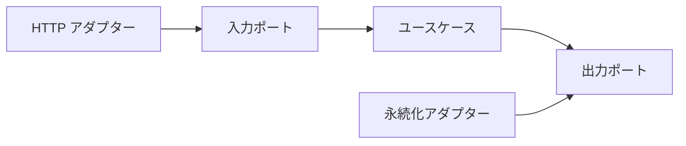

# クリーンアーキテクチャとヘキサゴナル

データベース製品や Web フレームワークを変更する予定がなくても、その API が業務ルールの中まで入り込むと、単体テストや小さな仕様変更にも外部環境が必要になります。  
クリーンアーキテクチャとヘキサゴナルアーキテクチャは、重要なルールを外部技術の都合から守るための考え方です。  

## このページで分かること

- クリーンアーキテクチャの依存性のルール
- ヘキサゴナルアーキテクチャのポートとアダプター
- 二つの考え方をひとつの実装へまとめる方法
- 境界を増やす費用と、採用範囲の決め方

## 共通する中心的な考え

どちらも、アプリケーションの中心に業務ルールやユースケースを置きます。  
データベース、HTTP、メッセージング、フレームワークは外側の詳細として扱います。  

中心は外側の具体的な API を知りません。  
外側が、中心側で定義した契約に合わせます。  



矢印はコード上の依存方向を表します。  
実行時にはユースケースから永続化アダプターが呼ばれますが、インタフェースを中心側へ置くことで、ソースコードの依存は外側から内側へ向きます。  

## クリーンアーキテクチャの依存性のルール

クリーンアーキテクチャでは、同心円の内側ほど方針や業務ルール、外側ほど技術詳細として説明されます。  
依存性のルールは、ソースコードの依存を内側へ向け、内側が外側を知らないようにすることです。  

代表的な役割は次のとおりです。  

- **Entities**: 複数のユースケースで使う中心的な業務ルール
- **Use Cases**: アプリケーション固有の操作と手順
- **Interface Adapters**: 外部形式と内側の形式を変換する
- **Frameworks and Drivers**: Web、データベース、外部サービスなど

名称や層数をそのままパッケージへ写すことより、内側が外側の変更から独立していることが重要です。  

## ヘキサゴナルのポートとアダプター

ヘキサゴナルアーキテクチャは Ports and Adapters とも呼ばれます。  
アプリケーションを内側に置き、外界との接点をポート、そのポートへ接続する技術実装をアダプターと考えます。  

ポートには二つの向きがあります。  

- **入力ポート**: 外側がアプリケーションへ依頼できる操作
- **出力ポート**: アプリケーションが外側へ求める能力

```java
interface PlaceOrder {
    OrderId execute(PlaceOrderCommand command);
}

interface OrderStore {
    void save(Order order);
}
```

`PlaceOrder` は HTTP Controller やバッチから呼ばれる入力ポートです。  
`OrderStore` はユースケースが永続化へ求める出力ポートです。  

```java
final class PlaceOrderService implements PlaceOrder {
    private final OrderStore orderStore;

    PlaceOrderService(OrderStore orderStore) {
        this.orderStore = orderStore;
    }

    @Override
    public OrderId execute(PlaceOrderCommand command) {
        Order order = Order.create(command.lines());
        orderStore.save(order);
        return order.id();
    }
}
```

HTTP Controller は入力アダプター、データベース実装は出力アダプターになります。  
同じ入力ポートを CLI やテストから呼び、同じ出力ポートへメモリ実装を接続できます。  

:::tip[ポートの名前]

技術名ではなく、内側が必要とする目的で名付けます。  
`SqlExecutor` より `OrderStore` の方が、保存技術を変えても契約を保ちやすくなります。  

:::

## 二つを統合して考える

クリーンアーキテクチャは依存の層と方向を強調し、ヘキサゴナルは外界との接続点をポートとアダプターで表します。  
実装では、両方の語彙を組み合わせられます。  

たとえば次のようなパッケージ構成です。  

```text
order/
├── domain/
│   └── Order.java
├── application/
│   ├── PlaceOrder.java
│   ├── PlaceOrderService.java
│   └── OrderStore.java
└── adapter/
    ├── web/
    │   └── OrderController.java
    └── persistence/
        └── DatabaseOrderStore.java
```

`domain` と `application` はフレームワーク固有の型を避けます。  
`adapter` は外部形式を内側のコマンドやドメインオブジェクトへ変換します。  
依存性注入の設定は、具体的な実装を組み立てる外側に置きます。  

## 境界で変換する

外部の JSON、データベースの行、メッセージ形式は、内側のモデルと変更理由が異なります。  
アダプターで相互に変換すると、外部形式の変更を境界へ閉じ込められます。  

```java
final class OrderController {
    private final PlaceOrder placeOrder;

    OrderResponse post(OrderRequest request) {
        PlaceOrderCommand command = request.toCommand();
        OrderId id = placeOrder.execute(command);
        return new OrderResponse(id.value());
    }
}
```

変換コードは増えます。  
単純なアプリケーションでは、すべての境界に別の型を作る利益が小さいこともあります。  
公開 API、業務モデル、永続化形式がそれぞれ独立して変わるかを見て決めます。  

## テストへの効果

中心のユースケースが Java の通常のオブジェクトとポートだけに依存すれば、外部環境なしで規則を確認できます。  

```java
final class InMemoryOrderStore implements OrderStore {
    private final List<Order> saved = new ArrayList<>();

    @Override
    public void save(Order order) {
        saved.add(order);
    }
}
```

これは本番のデータベーステストを不要にするものではありません。  
中心の高速なテストと、アダプターが実際の技術へ正しく接続する統合テストを分ける助けになります。  

## 使わない方がよい場面

単純な CRUD、寿命の短いツール、技術詳細と業務ルールの区別がほとんどない処理では、多数のポートと変換が負担になることがあります。  
また、境界を作っても、インタフェースへ外部ライブラリの型を露出すれば独立性は得られません。  

次の問いで採用範囲を調整します。  

- 中心として守りたい業務規則があるか
- 外部技術の変更頻度やテスト費用が高いか
- 複数の入力方法や出力先があるか
- 変換と配線の費用をチームが負担できるか

## よくあるつまずき

- 円や六角形の図をパッケージ名へ写すことが目的になる
- ポートへ HTTP やデータベース製品の型をそのまま公開する
- 入力アダプターに業務規則を書き、中心が空になる
- すべての操作へ一律にポートを作り、処理を追いにくくする
- 単体テスト用の代替実装だけを確認し、本番アダプターの統合テストを省く

## まとめ

- 依存性のルールは、外側の技術詳細から内側の方針へ依存を向ける
- ポートはアプリケーションの入出力契約、アダプターは外部技術との変換と接続を担う
- クリーンとヘキサゴナルは競合せず、中心を守る共通目的で統合できる
- 境界には変換と配線の費用があるため、守りたい変化に合わせて採用する

次は [DDD の入口](./ddd-intro) で、業務の言葉とモデルを結び付けます。  
