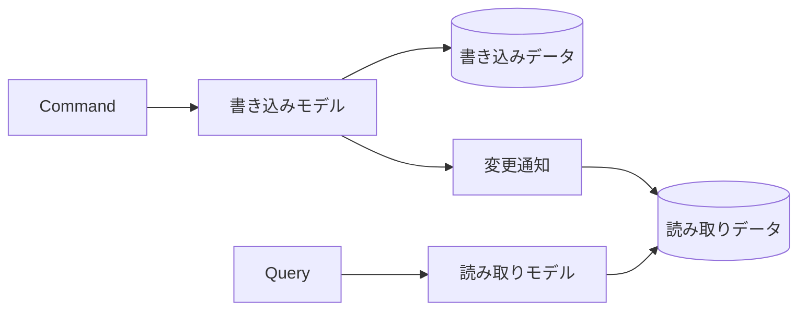

# 分散システムの設計スタイル

読み取りを速くしたい、変更履歴を厳密に残したい、機能ごとに独立してリリースしたいという要望から、CQRS、イベントソーシング、マイクロサービスが候補に挙がることがあります。  
これらは効果が大きい一方、データの一貫性、監視、障害対応という新しい難しさを持ち込みます。

ひとつの倉庫で在庫と帳票をまとめて扱うのと、倉庫を別棟に分けて連絡便でつなぐのでは、速さも故障の形も変わります。  
分散スタイルは「棟を分ける」選択であり、連絡便の遅延や途中紛失まで設計に含めます。

## このページで分かること

- CQRS が書き込みと読み取りを分ける理由
- イベントソーシングが状態ではなく出来事を保存する意味
- マイクロサービスの利点と分散システムとしての費用
- 大きな設計を選ぶ前に確認する観点

## CQRS

CQRS（Command Query Responsibility Segregation）は、状態を変更するモデルと、状態を読み取るモデルを分けるパターンです。

- **Command 側**: 業務規則を検証し、状態を変更する
- **Query 側**: 画面や検索に必要な形でデータを返す



読み取り画面が複雑でも、書き込み側の Aggregate を表示都合で崩さずに済みます。  
読み取り専用の形式やインデックスを用意し、検索に適した形へ最適化できます。

一方、書き込み結果が読み取り側へ反映されるまで遅延する場合があります。  
利用者には「保存直後なのに一覧へ見えない」ように映るため、結果整合性を前提とした UI や再試行が必要です。

:::info[CQS とは規模が違う]

CQS はメソッド単位の更新と問い合わせの分離、CQRS はモデルやデータ経路を分けるアーキテクチャパターンです。

:::

## イベントソーシング

イベントソーシング（Event Sourcing）は、現在状態だけを保存する代わりに、状態を変えた出来事を追記して保存します。

```text
OrderCreated
OrderLineAdded
OrderConfirmed
```

注文の現在状態は、これらのイベントを順に適用して再構築します。  
いつ何が起きたかを履歴として残せ、過去時点の状態復元や新しい読み取りモデルの再生成に利用できます。

ただし、イベントは後から意味を変えにくい永続データです。  
スキーマ進化、再生時間、重複処理、順序保証、個人情報の削除要件などを設計する必要があります。  
監査ログが欲しいだけなら、通常の状態保存と監査テーブルの方が運用しやすい場合もあります。

<details>
<summary>スナップショット</summary>

イベント数が多い Aggregate を毎回先頭から再生すると時間がかかります。  
途中時点の状態をスナップショットとして保存し、それ以降のイベントだけを適用する方法があります。  
スナップショットは派生データとして再生成できるようにし、イベント列を正本として扱う設計が一般的です。

</details>

## CQRS とイベントソーシングの関係

CQRS とイベントソーシングは別のパターンで、必ず同時に使うものではありません。  
CQRS は通常のデータベース更新でも実現でき、イベントソーシングも同じモデルから問い合わせる構成にできます。

組み合わせると、書き込み側がイベントを保存し、そのイベントから読み取りモデルを更新できます。  
その代わり、イベント配送、再処理、読み取り側の遅延など、運用対象が増えます。

## マイクロサービス

マイクロサービスは、業務能力の境界でサービスを分け、独立して開発、デプロイ、運用できるようにする設計スタイルです。  
単にコードを小さな Web API へ分割することではありません。

期待できる利点には次があります。

- 変更頻度の異なる領域を独立してリリースできる
- サービスごとにスケールや可用性の要件を調整できる
- 境界ごとにモデルとデータの所有権を明確にできる
- 小さなチームが担当範囲を自律的に運用できる

一方、同一プロセス内のメソッド呼び出しがネットワーク通信へ変わります。  
遅延、タイムアウト、部分障害、再試行、重複実行、バージョン互換性を扱わなければなりません。

## データとトランザクション

サービスが独立するには、ほかのサービスのデータベースを直接更新しないことが基本です。  
サービスをまたぐ一つの ACID トランザクション（単一 DB での原子的な成功／失敗のまとまり）に頼れないため、処理の途中状態と失敗時の回復を設計します。  
手元の `commit` / `rollback` の感覚は [JDBC の基礎](../basics/jdbc-basics) を参照してください。

たとえば注文確定後に在庫引当が失敗した場合、次のような方針があります。

- 注文を「確認待ち」として残し、再試行する
- 補償操作で注文をキャンセルする
- 手動対応が必要な状態として記録し、通知する

どの方針でも、同じメッセージを複数回受けても結果を壊さない冪等性が重要です。  
「一度だけ届く」ことを前提にせず、処理済み ID や状態遷移で重複を吸収します。

## 可観測性と運用

分散した処理は、一つのログファイルだけでは追跡できません。  
相関 ID を引き継いだログ、メトリクス、分散トレーシング、アラート、実行手順が必要になります。

サービスごとのデプロイ自由度を得ても、互換性のない API 変更を同時リリースでしか解決できないなら、実際には強く結合しています。  
後方互換な変更、コンシューマー契約テスト、段階的な移行を考えます。

:::warning[分割すると障害点が増える]

マイクロサービスは組織や運用能力まで含む選択です。  
コード量だけを理由に分割すると、通信と運用の費用が利点を上回ることがあります。

:::

## モジュラーモノリスという選択

ひとつのデプロイ単位を保ちながら、業務境界ごとにモジュールを分ける構成をモジュラーモノリスと呼びます。  
プロセス内通信と一つの運用単位を保ちつつ、依存方向やデータ所有をコード上で整理できます。

将来サービス分割が必要になった場合も、明確なモジュール境界が出発点になります。  
ただし、将来必ず分割することを約束する設計ではなく、現在の複雑さへ適した選択として考えます。

## 選択前に確認すること

- 現在のボトルネックは読み取り、書き込み、開発体制、運用のどれか
- 結果整合性や部分障害を利用者と業務が許容できるか
- イベントの長期互換性と再処理を運用できるか
- サービスごとの監視、当番、デプロイを担えるか
- 単純な分割やモジュール化で問題を解決できないか

## よくあるつまずき

- CQRS を DTO を二つ作るだけの規則として扱う
- イベントを後から自由に修正できるログと考える
- サービスをテーブル単位や技術レイヤー単位で分割する
- リモート呼び出しを通常のメソッド呼び出しと同じ信頼性で扱う
- 分散トランザクションの途中状態や再試行時の重複を設計しない

## まとめ

- CQRS は書き込みと読み取りのモデルを分け、それぞれの要件へ最適化する
- イベントソーシングは出来事を正本として保存し、履歴と再構築能力を得る
- マイクロサービスは独立性を得る代わりに、通信、整合性、運用の複雑さを負う
- 大きな構成を選ぶ前に、モジュラーモノリスを含む小さな解決策と比較する

次は [リファクタリングの道具箱](./refactoring-toolkit) で、既存コードを段階的に改善する方法を学びます。
