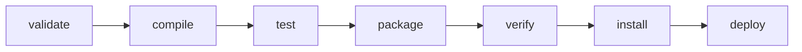

# ビルドライフサイクル

「JAR を作りたいから、コンパイルとテストのコマンドを順番に実行する」と考えると、手順の抜けや順序違いが起きます。  
Maven では、ビルドを段階に分けたライフサイクルを使い、到達したい段階を指定します。  
前段階の処理も順に実行されるため、ビルド手順を短いコマンドで再現できます。

## このページで分かること

- `clean`、`compile`、`test`、`package`、`install`、`deploy` の役割
- フェーズを指定したときに前段階も実行される仕組み
- フェーズとプラグインゴールの違い
- 日常の開発と配布で使うコマンドの選び方

## Maven の 3 つのライフサイクル

Maven には、役割の異なる 3 つの組み込みライフサイクルがあります。

- `default`: コンパイル、テスト、パッケージ化、配布を行う
- `clean`: 前回のビルド成果物を削除する
- `site`: プロジェクト情報のサイトを生成する

日常的な Java 開発では、主に `default` と `clean` を使います。  
ライフサイクルは複数の「フェーズ」で構成され、フェーズはビルドの段階を表します。

組み立てラインだと考えてください。  
途中の駅（フェーズ）を指定すると、入口からその駅までの工程が順番に動きます。

## default ライフサイクルの主なフェーズ

`default` ライフサイクルには多くのフェーズがありますが、最初は次の流れを押さえると全体を追えます。



- `compile`: `src/main/java` のソースコードをコンパイルする
- `test`: テストコードをコンパイルし、単体テストを実行する
- `package`: JAR や WAR など、`packaging` に応じた成果物を作る
- `install`: 成果物をローカルリポジトリへ登録する
- `deploy`: 成果物をリモートリポジトリへ配布する

後ろのフェーズを指定すると、同じライフサイクル内の前のフェーズも順に実行されます。  
たとえば `package` を実行すれば、コンパイルとテストを個別に実行してからパッケージ化する必要はありません。

## package まで実行する

プロジェクトのルート、つまり `pom.xml` があるディレクトリで次のコマンドを実行します。

```bash
mvn package
```

テストが成功して JAR を作成できた場合、末尾付近には次のように表示されます。

```text
[INFO] Building jar: /workspace/order-api/target/order-api-1.0.0-SNAPSHOT.jar
[INFO] ------------------------------------------------------------------------
[INFO] BUILD SUCCESS
[INFO] ------------------------------------------------------------------------
```

`BUILD SUCCESS` がビルド全体の成功を示し、`Building jar` の行から作成先を確認できます。  
標準構成では、コンパイル結果や成果物は `target` ディレクトリへ出力されます。

:::tip[必要な到達点を指定する]

JAR の作成が目的なら `mvn package`、ローカルの別プロジェクトから参照したいなら `mvn install` のように、必要なフェーズを指定します。  
前のフェーズは Maven が順番に実行します。

:::

## clean で前回の成果物を取り除く

`clean` は独立したライフサイクルのフェーズで、通常は `target` ディレクトリを削除します。  
前回の生成物を残さずにビルドしたい場合は、別のライフサイクルのフェーズと並べて実行できます。

```bash
mvn clean package
```

代表的な成功時の末尾は `mvn package` と同様に `BUILD SUCCESS` です。  
ログの前半に `maven-clean-plugin` による `target` の削除、後半にテストと成果物作成が表示されます。

毎回 `clean` が必要とは限りません。  
差分ビルドで十分な開発中に常に削除すると、ビルド時間が長くなることがあります。  
生成物が古い疑いがあるときや、CI で空の作業領域を再現したいときなど、目的に応じて使います。

## install と deploy の違い

`install` は作成した成果物と POM を、自分の端末のローカルリポジトリへ登録します。  
同じ端末にある別プロジェクトは、その座標を依存関係として解決できるようになります。

`deploy` は、共有するリモートリポジトリへ成果物をアップロードします。  
通常は認証情報、配布先、リリース手順が必要になるため、CI や権限を管理した環境から実行します。

:::warning[deploy は配布操作]

`mvn deploy` は共有リポジトリへ成果物を送る操作です。  
対象リポジトリ、バージョン、認証設定、プロジェクトのリリース手順を確認してから実行します。

:::

## フェーズとゴールを区別する

フェーズは「ビルドのどの段階まで進めるか」を表します。  
ゴールは「プラグインが提供する具体的な処理」を表します。

ラインの駅名がフェーズ、その駅で動く作業員の具体的な仕事がゴール、という対応です。

たとえば `compile` フェーズには、標準的な JAR プロジェクトでは Compiler Plugin の `compile` ゴールが結び付いています。  
コマンドでは、次のように見分けられます。

```text
mvn package
    └─ package フェーズまでライフサイクルを実行

mvn dependency:tree
    └─ Dependency Plugin の tree ゴールを直接実行
```

ゴールを直接指定する形式は、通常 `プラグイン接頭辞:ゴール` です。  
`dependency:tree` のような調査用ゴールは、ライフサイクルの段階を進めるのではなく、その処理だけを実行します。

<details>
<summary>テストを一時的に省略する指定</summary>

`-DskipTests` はテストの実行を省略しますが、テストコードのコンパイルは行います。  
`-Dmaven.test.skip=true` は、テストコードのコンパイルも実行も省略します。  
どちらも不具合を見逃す可能性があるため、速度を優先する一時的な調査など、理由が明確な場面に限ります。  
通常の検証や CI では、テストを実行した結果を基準にします。
</details>

## よくあるつまずき

- `package` の前に `compile` と `test` を毎回個別に実行する
- `clean` が `default` ライフサイクルの一部だと考える
- `install` を共有リポジトリへの配布だと誤解する
- フェーズ名と `plugin:goal` 形式のゴールを同じものとして扱う
- テストを省略した成果物を、通常の検証済み成果物として扱う

## まとめ

- ライフサイクルは複数のフェーズからなり、指定したフェーズまで順番に実行される
- `package` は成果物を作り、`install` はローカルへ登録し、`deploy` はリモートへ配布する
- `clean` は前回のビルド成果物を取り除く独立したライフサイクルである
- フェーズは段階、ゴールはプラグインの具体的な処理を表す

次は [依存関係の管理](./dependencies) で、ビルドに使われるライブラリの範囲と競合の調べ方を学びます。
