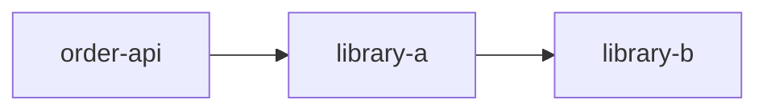
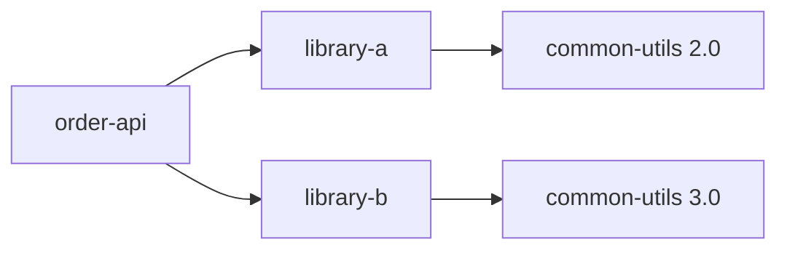

# 依存関係の管理

POM に直接書いていないライブラリがクラスパスに入り、同じライブラリの別バージョンまで見つかる。  
この状態でエラーになったとき、依存関係を一覧で眺めるだけでは、どこから来たのか判断できません。  
Maven の依存解決では、利用範囲、推移的依存、競合時の選択規則を分けて理解することが大切です。

## このページで分かること

- 依存関係のスコープとクラスパスへの影響
- 推移的依存が取り込まれる仕組み
- `dependency:tree` を使った経路と競合の調査
- `dependencyManagement`、BOM、`exclusions` の使い分け

## スコープで利用範囲を表す

`scope` は、依存関係がコンパイル、テスト、実行などのどこで必要かを表します。  
主なスコープは次のとおりです。

- `compile`: コンパイル、テスト、実行で使い、省略時の既定値
- `provided`: コンパイルとテストでは使うが、実行環境から提供される前提（アプリサーバの API など。クラスパスの見え方は [JVM とクラスローディング](../basics/jvm-and-classloading) ともつながる）
- `runtime`: コンパイルには不要だが、実行とテストで使う
- `test`: テストコードのコンパイルと実行だけで使う
- `system`: 指定したローカルファイルを使うため環境依存になり、通常は避ける
- `import`: `dependencyManagement` 内で BOM を取り込む場合に使う

買い物リストに「テスト用だけ」「本番では倉庫側が用意する」とメモを付けるイメージです。  
たとえばテストライブラリは、アプリケーション本体の実行時には不要です。  
`test` スコープにすることで、本体を利用する側へ不要な依存関係が伝わることを防げます。

```xml
<dependency>
  <groupId>org.junit.jupiter</groupId>
  <artifactId>junit-jupiter</artifactId>
  <version>5.11.0</version>
  <scope>test</scope>
</dependency>
```

:::tip[scope は必要な場所を表す]

「取得したいから `compile`」ではなく、その依存関係がコンパイル時、テスト時、実行時のどこで必要かを基準に選びます。

:::

## 推移的依存

プロジェクトがライブラリ A に依存し、ライブラリ A がライブラリ B に依存している場合、Maven は通常 B も解決します。  
このように、直接宣言した依存関係を通じて入る依存関係を「推移的依存」と呼びます。



推移的依存により、すべてのライブラリを POM へ列挙する必要はありません。  
一方で、ライブラリ A の更新によって B のバージョンが変わることもあるため、実際に解決された構成を確認できる必要があります。

アプリケーションのコードから B の API を直接使うなら、A 経由で偶然入る状態に頼らず、B を直接依存として宣言します。  
これにより、コードが何に依存しているかが POM に表れます。

## dependency:tree で経路を調べる

解決された依存関係と、その取り込み経路は次のコマンドで確認します。

```bash
mvn dependency:tree
```

代表的な出力は次のとおりです。

```text
[INFO] com.example:order-api:jar:1.0.0-SNAPSHOT
[INFO] +- com.example:library-a:jar:2.1.0:compile
[INFO] |  \- org.example:common-utils:jar:3.0.0:compile
[INFO] \- org.junit.jupiter:junit-jupiter:jar:5.11.0:test
[INFO] ------------------------------------------------------------------------
[INFO] BUILD SUCCESS
```

行頭の枝から依存関係の親子を読み、行末でスコープを確認します。  
この例では `common-utils` は `library-a` を経由して入り、JUnit は直接宣言された `test` スコープの依存関係です。

競合で選ばれなかった依存関係も調べる場合は、詳細表示を使います。

```bash
mvn dependency:tree -Dverbose
```

`omitted for conflict with ...` と表示された項目は、同じ成果物の別バージョンとの競合により採用されなかった候補です。

## バージョン競合は近い経路が優先される

同じ `groupId` と `artifactId` の異なるバージョンが複数の経路から現れると、Maven は原則としてプロジェクトから近い依存関係を選びます。  
深さが同じ場合は、POM で先に現れた宣言が選ばれます。  
この規則は「新しいバージョンが自動的に選ばれる」という意味ではありません。



どちらが採用されるかを宣言順に任せると、POM の並べ替えで結果が変わり得ます。  
必要なバージョンを直接依存または `dependencyManagement` で明示し、テストで互換性を確認します。

## dependencyManagement でバージョンを統一する

`dependencyManagement` は、依存関係のバージョンやスコープの既定値を管理する場所です。  
ここに書いただけでは、通常その依存関係はクラスパスへ追加されません。  
子 POM や同じ POM の `dependencies` で依存関係を宣言したときに、管理したバージョンが適用されます。

カタログに「この材料は 3.0.0 で揃える」と書いておくイメージです。  
棚に並べる（`dependencies` に書く）までは、まだ買い物リストに載りません。

```xml
<dependencyManagement>
  <dependencies>
    <dependency>
      <groupId>org.example</groupId>
      <artifactId>common-utils</artifactId>
      <version>3.0.0</version>
    </dependency>
  </dependencies>
</dependencyManagement>

<dependencies>
  <dependency>
    <groupId>org.example</groupId>
    <artifactId>common-utils</artifactId>
  </dependency>
</dependencies>
```

複数モジュールで同じライブラリを使う場合、親 POM の `dependencyManagement` でバージョンをそろえ、各モジュールは必要な依存関係だけを宣言できます。

:::info[管理と追加は別]

`dependencyManagement` は採用するバージョンを管理し、`dependencies` はそのプロジェクトで使う依存関係を追加します。

:::

## BOM で関連ライブラリの版をそろえる

BOM（Bill of Materials）は、関連する複数ライブラリの互換性を考慮したバージョン一覧を提供する POM です。  
提供元が公開している BOM を `import` すると、個々の依存関係にバージョンを書かず、組み合わせをそろえられます。

```xml
<dependencyManagement>
  <dependencies>
    <dependency>
      <groupId>org.example.platform</groupId>
      <artifactId>example-bom</artifactId>
      <version>2.4.0</version>
      <type>pom</type>
      <scope>import</scope>
    </dependency>
  </dependencies>
</dependencyManagement>

<dependencies>
  <dependency>
    <groupId>org.example.platform</groupId>
    <artifactId>example-core</artifactId>
  </dependency>
</dependencies>
```

BOM は互換性確認の負担を減らしますが、取り込めば常に最新になるわけではありません。  
BOM 自体のバージョンを選び、更新時にはリリースノートとテスト結果を確認します。

## exclusions は経路を限定して除外する

特定の直接依存から不要な推移的依存が入る場合は、`exclusions` でその経路から除外できます。

```xml
<dependency>
  <groupId>com.example</groupId>
  <artifactId>library-a</artifactId>
  <version>2.1.0</version>
  <exclusions>
    <exclusion>
      <groupId>org.example</groupId>
      <artifactId>legacy-logging</artifactId>
    </exclusion>
  </exclusions>
</dependency>
```

除外すると、そのライブラリが実行時に必要としていたクラスまで消える可能性があります。  
競合の理由と依存経路を `dependency:tree` で確認し、除外後にテストしてから採用します。

<details>
<summary>依存関係の更新を検討するとき</summary>

依存関係の更新では、直接依存の版だけでなく、推移的依存の変化も確認します。  
更新前後で `dependency:tree` を比較し、削除・追加・バージョン変更が意図したものかを見ます。  
脆弱性対応では、単に除外して警告を消すのではなく、安全な版へ更新できるか、互換性を含めて確認します。
</details>

## よくあるつまずき

- 推移的依存で入った API を、直接依存を宣言せずに利用する
- 競合時には常に最新バージョンが選ばれると考える
- `dependencyManagement` に書けば依存関係が追加されると思う
- BOM の個別バージョンを上書きし、検証済みの組み合わせを崩す
- 原因を調べずに `exclusions` を追加し、実行時エラーを招く

## まとめ

- スコープは依存関係が必要なコンパイル、テスト、実行の範囲を表す
- 推移的依存の経路と競合は `mvn dependency:tree` で確認する
- `dependencyManagement` と BOM はバージョンを統一するが、依存関係自体の追加とは役割が異なる
- `exclusions` は必要性と影響を確認し、特定の依存経路を除外するために使う

次は [ビルド設定と settings.xml](./build-and-settings) で、ビルド処理を担うプラグインと環境固有設定を整理します。
