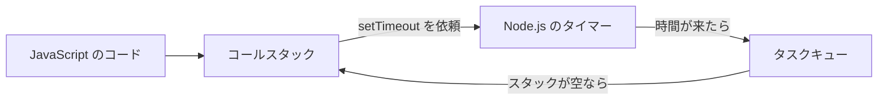

# 実行の仕組み

「少し待ってから動かしたい」処理を書くと、上から下への順番だけでは説明できない動きに出会います。  
たとえば、待ち時間をほぼ 0 にしても、いま実行中の `console.log` よりあとに回される、といった場面です。

入門編で書き方を一通り押さえたあと、ここからは **実行の仕組み・参照・非同期** を見ていきます。  
答えを丸暗記するより、JavaScript がコードを実行する場所と、あとで実行する処理の待ち場所を地図にしておくと判断しやすくなります。  
このページでは、コールスタック、タスクキュー、イベントループの関係を入口に絞って扱います。

## このページで分かること

- JavaScript エンジンと Node.js の関係
- 同期関数を実行するコールスタック
- `setTimeout` のコールバックが待つタスクキュー
- イベントループが処理を進める条件
- `setTimeout(..., 0)` を含むログの順番

## JavaScript を動かすエンジンと Node.js

JavaScript の構文を読み、計算や関数呼び出しを実行するのが **JavaScript エンジン** です。  
Node.js は、Google Chrome でも使われている **V8** という JavaScript エンジンを組み込んでいます。

ただし、V8 だけですべてを担当するわけではありません。  
Node.js は、タイマーやファイル操作など、実行環境として必要な機能も提供します。  
コードから呼び出せる、そうした環境側の窓口を **実行環境の機能** と呼びます（HTTP で外部サービスと話す「API」とは別の話です）。

```text
Node.js
├── V8: JavaScript の式や関数を実行する
└── 実行環境の機能: タイマーやファイル操作などを扱う
```

たとえば `setTimeout` は、指定した時間が経過したあとに関数を実行できるよう、Node.js 側のタイマー機能を利用します。

:::tip[役割の分け方]

V8 が JavaScript を実行し、Node.js がタイマーなど実行環境の機能を提供します。

:::

## コールスタックは「実行中の関数」を積む場所

JavaScript エンジンは、いま実行している関数を **コールスタック** で管理します。  
スタックは、最後に載せたものから先に取り出す積み重ねです。

次のコードを見てみましょう。

```js
function printStatus() {
  console.log('OPEN');
}

function run() {
  printStatus();
}

run();
```

実行は次のように進みます。

1. スクリプトから `run` を呼び、`run` がスタックに積まれる
2. `run` から `printStatus` を呼び、上に積まれる
3. `printStatus` が `console.log` を実行して終わり、スタックから外れる
4. `run` も終わり、スタックから外れる

```text
実行中                         戻るとき

┌─────────────────┐
│ printStatus()   │  ← 先に終わる
├─────────────────┤
│ run()           │
└─────────────────┘
        ↓
┌─────────────────┐
│ run()           │  ← 次に終わる
└─────────────────┘
        ↓
      空になる
```

関数の中から別の関数を呼ぶと上へ積み、関数が終わると上から外します。  
通常の同期処理では、いま積まれている処理が終わるまで、次の処理へは進みません。

<QuizChoice
title="コールスタックの順番"
options={[
{ id: 'a', label: 'run が先に終わり、そのあと printStatus が終わる' },
{ id: 'b', label: 'printStatus が先に終わり、そのあと run が終わる' },
{ id: 'c', label: 'ふたつの関数が同時に終わる' },
]}
answer="b"
explanation="run の上に printStatus が積まれます。スタックは上にある printStatus から先に終了します。"

>

  <div><code>run</code> の中から <code>printStatus</code> を呼んだ場合、関数が終わる順番はどれですか。</div>
</QuizChoice>

## 「あとで実行する関数」は待ち場所へ進む

`setTimeout` は、関数と待ち時間を受け取ります。  
受け取った関数は **コールバック関数** と呼ばれます。

```js
setTimeout(() => {
  console.log('later');
}, 1000);
```

このコードは、JavaScript の実行を 1 秒間止める命令ではありません。  
Node.js のタイマーにコールバックを預け、現在のコードは先へ進みます。

指定時間が過ぎて実行できる状態になったコールバックは、**タスクキュー** という待ち行列で順番を待ちます。  
キューに入っただけでは、まだ実行されません。

## イベントループがスタックの空きを確認する

**イベントループ** は、コールスタックと待っているタスクの状態を確認し続ける仕組みです。  
コールスタックが空になると、タスクキューで待っているコールバックを実行できるようにします。

一人で窓口を担当する係を想像すると整理しやすくなります。  
係がいまの手続き（コールスタック）を処理している間、時間が来た別の依頼は受付待ちの列（タスクキュー）に並びます。イベントループは、窓口が空いたときに列の次の依頼を渡す役目です。  
このたとえの要点は、待ち時間が終わっても、実行中の処理へ割り込まないことです。



流れをまとめると、次のようになります。

1. JavaScript の同期処理がコールスタックで実行される
2. `setTimeout` のコールバックは Node.js のタイマーへ預けられる
3. 指定時間が過ぎると、コールバックはタスクキューで待つ
4. コールスタックが空になると、待っていたコールバックを実行できる

:::tip[0 ミリ秒の意味]

`setTimeout(callback, 0)` は「今すぐ実行」ではなく、「待ち時間をほぼ置かず、現在の同期処理が終わったあとに実行できるようにする」です。

:::

## ログの順番を追う

次の定番例を、地図に沿って追います。

```js
console.log('A');

setTimeout(() => {
  console.log('B');
}, 0);

console.log('C');
```

実行結果です。

```text
A
C
B
```

処理の流れは次のとおりです。

1. `console.log("A")` は同期処理なので、その場で `A` を表示する
2. `setTimeout` はコールバックをタイマーへ預け、次へ進む
3. `console.log("C")` が `C` を表示する
4. スクリプトの同期処理がすべて終わり、コールスタックが空になる
5. 待っていたコールバックが実行され、`B` を表示する

待ち時間が `0` でも、現在の同期処理へ割り込むわけではありません。  
この順番が分かると、「タイマーが壊れた」のではなく「実行できる順番を待っていた」と切り分けられます。

<QuizChoice
title="setTimeout とログの順番"
options={[
{ id: 'a', label: 'start → timeout → end' },
{ id: 'b', label: 'start → end → timeout' },
{ id: 'c', label: 'timeout → start → end' },
]}
answer="b"
explanation="setTimeout のコールバックは現在の同期処理が終わるまで待ちます。start と end が先に表示され、そのあと timeout が表示されます。"

>

  <div>次のコードの出力順はどれですか。</div>
  <pre className="language-js"><code>{`console.log("start");

setTimeout(() => {
console.log("timeout");
}, 0);

console.log("end");`}</code></pre>
</QuizChoice>

## 長い同期処理は「あとで」を待たせる

コールスタックで長い同期処理が続く間、タスクキューのコールバックは実行を待ちます。  
タイマーの待ち時間は「その時刻に必ず実行する」という予約ではなく、「その時間が過ぎたら実行候補になる」という下限です。

```js
setTimeout(() => {
  console.log('timer');
}, 0);

const startedAt = Date.now();

while (Date.now() - startedAt < 1000) {
  // 約 1 秒間、同期処理を続ける
}

console.log('sync done');
```

実行結果は次の順です。

```text
sync done
timer
```

タイマーの準備ができていても、`while` と `console.log("sync done")` が終わるまではコールスタックが空きません。  
大量の計算などで同期処理を長く占有すると、あとで実行する処理も遅れる点に注意が必要です。

<QuizChoice
title="タイマーが実行される条件"
options={[
{ id: 'a', label: '待ち時間が過ぎれば、実行中の関数へ割り込む' },
{ id: 'b', label: '待ち時間が過ぎ、コールスタックが空くまで待つ' },
{ id: 'c', label: '待ち時間に関係なく、ファイルの末尾で必ず実行する' },
]}
answer="b"
explanation="タイマーの待ち時間が過ぎても、同期処理の実行中には割り込みません。コールスタックが空いてから実行されます。"

>

  <div><code>setTimeout</code> のコールバックが実行される条件として正しいものはどれですか。</div>
</QuizChoice>

## よくあるつまずき

- `setTimeout(callback, 0)` を、その場で直ちに実行する命令だと思う
- タスクキューに入ったコールバックが、実行中の同期処理へ割り込むと思う
- タイマーの待ち時間を、正確な実行時刻の保証だと考える
- 長い同期処理が、タイマーなど「あとで動く処理」も待たせることを見落とす
- Node.js、JavaScript エンジン、イベントループをすべて同じ役割だと捉える

## まとめ / 次に学ぶとよいこと

- Node.js は V8 を組み込み、タイマーなどの実行環境の機能も提供する
- 同期関数はコールスタックに積まれ、上にある関数から終わる
- `setTimeout` のコールバックは、時間が来るとタスクキューで待つ
- イベントループにより、コールスタックが空いたあとで待機中のタスクが実行される
- `setTimeout(..., 0)` でも、現在の同期処理よりあとになる

次は [型と参照](./types-and-references) で、値のコピーとオブジェクトの共有がコードへどう現れるかを見ていきます。
