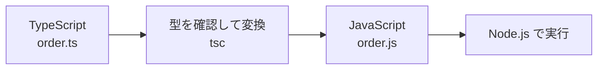

# TypeScript が必要な理由

プロパティ名を一文字間違えたのに、処理はしばらく進み、利用者がその画面を開いたところで初めて止まる。  
JavaScript では、値の形が想定と違っていても、その値を実際に使うまで気づけないことがあります。

TypeScript は、コードを実行する前に型を確認し、こうした食い違いを早い段階で知らせます。

## このページで分かること

- JavaScript で値の形を間違えたときに起きる問題
- TypeScript がエディタやコンパイル時に見つけるエラー
- TypeScript の型が実行時には残らないこと
- JavaScript と TypeScript の役割分担

## 値の形が違うと、実行してから止まる

次の JavaScript 関数は、注文を受け取り、利用者名を大文字にして返します。

```js
function createLabel(order) {
  return order.userName.toUpperCase();
}

const order = {
  username: 'Aiko',
};

console.log(createLabel(order));
```

関数は `userName` を読んでいますが、渡したオブジェクトのプロパティは `username` です。  
JavaScript は関数を呼び出すまでこの違いを指摘せず、実行すると `undefined` に対して `toUpperCase()` を呼んだため `TypeError` になります。

データを作る場所と使う場所が離れるほど、どちらの名前が正しいのかを人だけで確認するのは難しくなります。

## TypeScript は約束の食い違いを先に知らせる

TypeScript では、関数が受け取る値の形を書けます。

```ts
type Order = {
  userName: string;
};

function createLabel(order: Order): string {
  return order.userName.toUpperCase();
}

const order = {
  username: 'Aiko',
};

console.log(createLabel(order));
```

このコードでは、`createLabel(order)` の箇所に型エラーが表示されます。  
`Order` に必要な `userName` がなく、代わりに `username` があると、エディタや TypeScript コンパイラが教えてくれます。

```text
Property 'userName' is missing in type '{ username: string; }'
```

利用者が操作してからではなく、コードを書いている最中やコンパイル時に気づけるのが大きな利点です。

:::tip[型は早めの確認役]

TypeScript はすべての不具合を防ぐものではありません。  
それでも、値の種類やオブジェクトの形の食い違いを、実行前に見つけやすくします。

:::

<QuizChoice
title="エラーを見つける時点"
options={[
{ id: 'a', label: 'TypeScript は型の食い違いを実行前に指摘できる' },
{ id: 'b', label: 'TypeScript は実行中の例外だけを記録する' },
{ id: 'c', label: 'TypeScript を使うと実行時エラーが一切なくなる' },
]}
answer="a"
explanation="TypeScript は型をエディタやコンパイル時に確認します。ただし、通信失敗など実行時にしか分からない問題までなくなるわけではありません。"

>

  <div>TypeScript の役割を正しく表しているものはどれですか。</div>
</QuizChoice>

## 実際に動くのは JavaScript

Node.js やブラウザが、そのまま実行するのは JavaScript です。  
TypeScript コンパイラ `tsc` は、型を確認したあと、`.ts` ファイルを `.js` ファイルへ変換します。



たとえば、次の TypeScript を考えます。

```ts
function double(value: number): number {
  return value * 2;
}

console.log(double(3));
```

コンパイル後の JavaScript では、型注釈の `: number` が消えます。

```js
function double(value) {
  return value * 2;
}

console.log(double(3));
```

これを **型の消去** と捉えると、TypeScript と JavaScript の役割を分けやすくなります。  
型は開発中の確認に使われ、プログラムの実行時には JavaScript の値と処理が動きます。

そのため、型を書くだけで、通信相手や利用者から届くデータが実行時に正しい形へ変わるわけではありません。  
TypeScript は自分たちのコード内の食い違いを早く見つける役であり、外部から届くデータは実行時にも内容を確認する必要があります。

<QuizFill
title="実行されるファイル"
answer="js"
explanation="tsc は型を確認し、TypeScript を JavaScript に変換します。Node.js が実行するファイルの拡張子は .js です。"

>

  <div><code>tsc</code> で変換したあと、Node.js が実行するファイルの拡張子を入力してください。</div>
</QuizFill>

## よくあるつまずき

- TypeScript を入れれば、実行時の不具合がすべて消えると思う
- 型を書いただけで、通信先から届く JSON の形まで保証されると思う
- `.ts` をそのまま `node` で実行しようとする（まずは `tsc` で `.js` にする流れを押さえる）

## まとめ / 次に学ぶとよいこと

- JavaScript では、値の形の間違いが実行時まで見つからないことがある
- TypeScript は、型の食い違いをエディタやコンパイル時に指摘できる
- `tsc` は TypeScript を JavaScript へ変換し、その過程で型情報を消す
- Node.js やブラウザで実際に動くのは JavaScript。外部データの検証は別途必要

次は [基本の型](./basic-types) で、値にどのような型を付けるかを学びます。
