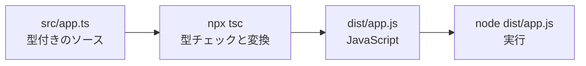

# tsconfig と開発の流れ

エディタには型エラーが出ていないのに、別の人の環境では設定が違い、見つかるエラーも異なる。  
TypeScript の確認方法をプロジェクトでそろえるには、コンパイラ設定を `tsconfig.json` に保存します。

このページでは、`.ts` を型チェックして `.js` へ変換し、Node.js で実行するまでを一つにつなげます。

## このページで分かること

- TypeScript コンパイラ `tsc` の導入方法
- `tsconfig.json` が担う役割
- `strict`、`rootDir`、`outDir` の基本設定
- `.ts` から `.js` を作り、Node.js で実行する流れ

## TypeScript コンパイラを用意する

作業用のディレクトリで、TypeScript を開発用パッケージとして導入します。

```bash
npm install --save-dev typescript
```

成功すると、追加されたパッケージと監査結果が表示されます。バージョンや件数は環境によって異なります。

```text
added 1 package, and audited 2 packages in 2s

found 0 vulnerabilities
```

`package.json` の `devDependencies` に `typescript` が追加されていれば、プロジェクトで使うバージョンを共有できます。

```json
{
  "devDependencies": {
    "typescript": "^6.0.0"
  }
}
```

ここでは、プロジェクトに導入したコマンドを `npx tsc` で呼び出します。  
利用者ごとに別のグローバル版を使わず、プロジェクトで決めた TypeScript を使える形です。

## `tsconfig.json` に設定をまとめる

プロジェクト直下に `tsconfig.json` を作り、次の内容を記述します。

```json
{
  "compilerOptions": {
    "target": "ES2022",
    "module": "NodeNext",
    "strict": true,
    "rootDir": "src",
    "outDir": "dist",
    "noEmitOnError": true
  },
  "include": ["src/**/*.ts"]
}
```

それぞれの設定には次の役割があります。

- `target`: 出力する JavaScript の基準。この例では ES2022
- `module`: Node.js のモジュールとして変換する設定
- `strict`: 厳格な型チェックをまとめて有効にする
- `rootDir`: TypeScript のソースを置く起点。この例では `src`
- `outDir`: 変換後の JavaScript を置く場所。この例では `dist`
- `noEmitOnError`: 型エラーがあるときに JavaScript を出力しない
- `include`: 型チェックとコンパイルの対象

:::tip[`strict` を基準にする]

新しいプロジェクトでは `strict: true` を基準にすると、`null` の見落としや暗黙の `any` などを早く見つけられます。

:::

設定を弱めてエラーを消すと、問題を実行時へ先送りすることがあります。  
まずエラーが示している値や型を確認し、外部データなら検証する、未定義になり得るなら分岐する、といった修正を検討します。

<QuizChoice
title="コンパイル先の設定"
options={[
{ id: 'a', label: 'rootDir' },
{ id: 'b', label: 'outDir' },
{ id: 'c', label: 'strict' },
]}
answer="b"
explanation="outDir は、コンパイルで生成した JavaScript ファイルを置くディレクトリを指定します。"

>

  <div>変換後の JavaScript を置くディレクトリを指定する設定はどれですか。</div>
</QuizChoice>

## `.ts` をコンパイルして実行する

次の構成でファイルを用意します。

```text
typescript-sample/
├── src/
│   └── app.ts
├── package.json
└── tsconfig.json
```

`src/app.ts` に、型の付いたプログラムを書きます。

```ts
type Order = {
  id: string;
  total: number;
};

function formatOrder(order: Order): string {
  return `${order.id}: ${order.total}円`;
}

const order: Order = {
  id: 'ORD-1001',
  total: 1200,
};

console.log(formatOrder(order));
```

プロジェクト直下で `tsc` を実行します。

```bash
npx tsc
```

型エラーがなければ、通常はメッセージを表示せずに終了し、`dist/app.js` が作られます。  
ターミナルに戻り、`dist/app.js` が存在していればコンパイル成功です。

```text
（出力なし）
```

生成された JavaScript を Node.js で実行します。

```bash
node dist/app.js
```

```text
ORD-1001: 1200円
```

出力の注文 ID と金額が、`src/app.ts` で渡した値と一致していることを確認します。



<QuizChoice
title="実行までの順序"
options={[
{ id: 'a', label: 'node src/app.ts → npx tsc' },
{ id: 'b', label: 'npx tsc → node dist/app.js' },
{ id: 'c', label: 'node tsconfig.json → npx tsc' },
]}
answer="b"
explanation="まず tsc で型を確認して JavaScript を生成し、そのあと生成物を Node.js で実行します。"

>

  <div>このページの設定で、TypeScript をコンパイルして実行する順序はどれですか。</div>
</QuizChoice>

## 型エラーが出たときの見方

`src/app.ts` の `total` を文字列に変えると、`Order` の約束に合わなくなります。

```ts
const order: Order = {
  id: 'ORD-1001',
  total: '1200',
};
```

`npx tsc` を実行すると、ファイル名、行と列、エラーコード、期待した型が表示されます。

```text
src/app.ts:12:3 - error TS2322: Type 'string' is not assignable to type 'number'.
```

この場合は、`src/app.ts` の 12 行目付近で、`number` が必要な場所に `string` を入れていると読めます。  
`noEmitOnError: true` により、型エラーを含む新しい JavaScript は出力されません。

:::warning[古い生成物に注意]

以前の `dist/app.js` が残っていると、コンパイルに失敗しても古いファイルを実行できてしまいます。  
`tsc` の終了結果を確認してから Node.js を実行してください。

:::

<details>
<summary>TypeScript を直接実行する開発ツール</summary>

開発中は、`tsx` や `ts-node` を使って `.ts` ファイルを直接実行するように見せる方法もあります。  
たとえば `tsx` なら、パッケージを導入したうえで次のように実行できます。

```bash
npx tsx src/app.ts
```

```text
ORD-1001: 1200円
```

内部では実行できる形への変換が行われています。  
まずは `tsc` で `.js` が作られ、その JavaScript を Node.js が実行する基本の流れを押さえてから使うと、ツールの役割を見失いにくくなります。

</details>

## まとめ

- TypeScript コンパイラはプロジェクトの開発用パッケージとして導入できる
- `tsconfig.json` に型チェックと出力先の設定をまとめる
- 新しいプロジェクトでは `strict: true` を基準にする
- `rootDir` は入力側、`outDir` は出力側のディレクトリ
- `npx tsc` で `.ts` を `.js` に変換し、生成物を `node` で実行する

次は [npm と開発ツール](../tooling/) へ進みます。  
依存パッケージとコマンドをプロジェクトで管理し、開発・確認・ビルドの流れを整えていきましょう。
